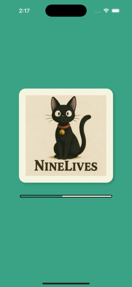
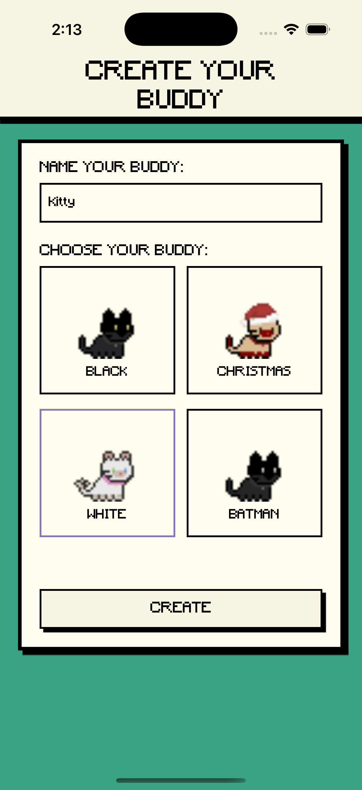

# NineLives 🐱
A virtual pet mobile application built with React Native and Expo. NineLives helps users track daily health habits like hydration, nutrition, and sleep through an engaging buddy care system.

## 🌟 Overview
NineLives is a health companion app that uses a virtual pet (your "buddy") to encourage healthy habits. Take photos of your meals, track your water intake, log your sleep, and watch your buddy thrive as you maintain good habits!

## 📱 App Screenshots

<div align="center">
  
  
  
</div>

<div align="center">
  
  
  
</div>

## ✨ Features
- **🐱 Virtual Pet System**: Create and care for your custom buddy
- **👤 User Authentication**: Secure login and registration via Supabase
- **🥗 Smart Meal Tracking**: Take photos of your food to feed your buddy (powered by Clarifai AI)
- **💧 Water Intake Monitoring**: Track your daily hydration with a cup counter
- **😴 Sleep Monitoring**: Log your sleep schedule and duration
- **👟 Step Counter**: Track your daily activity (where supported)
- **🎮 Gamified Health**: Health metrics affect your buddy's wellbeing
- **☁️ Cloud Sync**: Your buddy's status syncs across devices with Supabase

## 🚀 Tech Stack
- **Framework**: React Native + Expo
- **Backend**: Supabase for authentication and database
- **Navigation**: Expo Router
- **Storage**:
  - Supabase for cloud storage
  - AsyncStorage for local data
- **Camera**: Expo Camera
- **Sensors**: Expo Pedometer
- **AI & Analysis**:
  - Clarifai AI for food detection
  - Perplexity for nutritional analysis
- **Language**: TypeScript
- **UI Components**: Custom styled components

## 📱 App Screens
1. **Authentication**: Login and signup screens
2. **Splash Screen**: Animated loading screen
3. **Create Buddy**: Customize your health companion
4. **Buddy Dashboard**: Monitor your buddy's health metrics
5. **Food Camera**: Take photos of meals for tracking
6. **Social Features**: Share your buddy with friends

## 🛠️ Installation
1. Clone the repository:
```bash
git clone https://github.com/yourusername/NineLives.git
cd NineLives
```
2. Install dependencies:
```bash
npm install
```
3. Set up environment variables: Create a `.env` file in the root directory with your Supabase, Clarifai, and Perplexity credentials.
4. Start the development server:
```bash
npx expo start
```

## 📱 Running the App
- **iOS**: `npx expo run:ios`
- **Android**: `npx expo run:android`
- **Using Expo Go**: Scan the QR code with the Expo Go app

## 🔮 Future Enhancements using Perplexity
- **Health Insights**: Personalized recommendations
- **Achievements**: Unlock rewards for consistent healthy habits
- **Weekly Reports**: Track your health trends over time

## 📦 Dependencies
- React Native
- Expo
- Supabase
- AsyncStorage
- Expo Camera
- Expo Sensors
- React Native Reanimated
- Clarifai API
- Perplexity API

## 📝 License
This project is licensed under the MIT License - see the LICENSE file for details.

## 👥 Contributing
Contributions are welcome! Please feel free to submit a Pull Request.

## 🙏 Acknowledgements
- Built for BearHacks 2025
- Inspired by classic virtual pets and modern health tracking apps
- Special thanks to all the open-source libraries that made this possible
